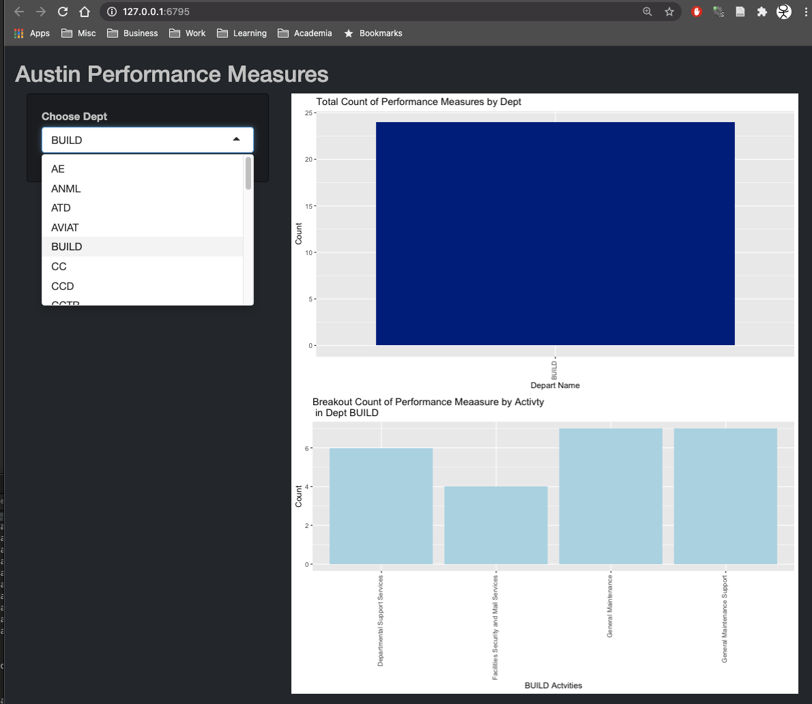
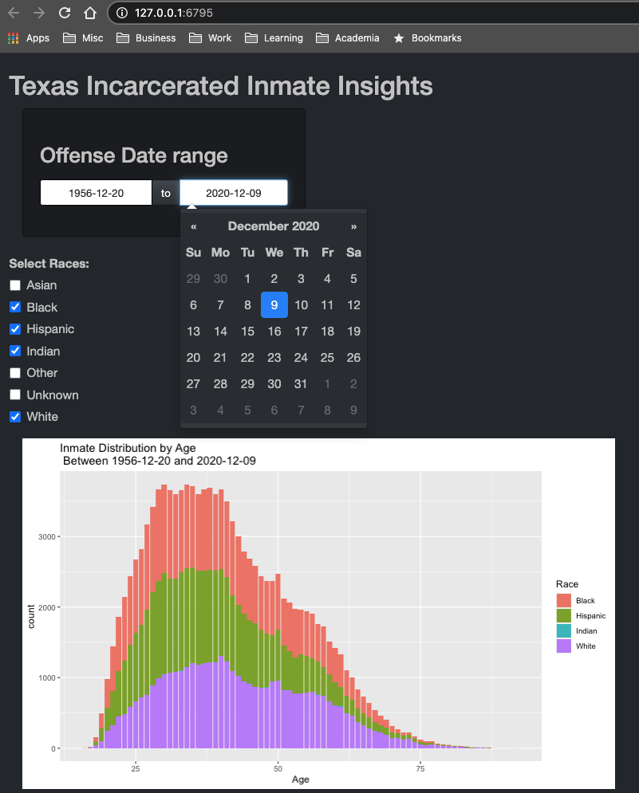
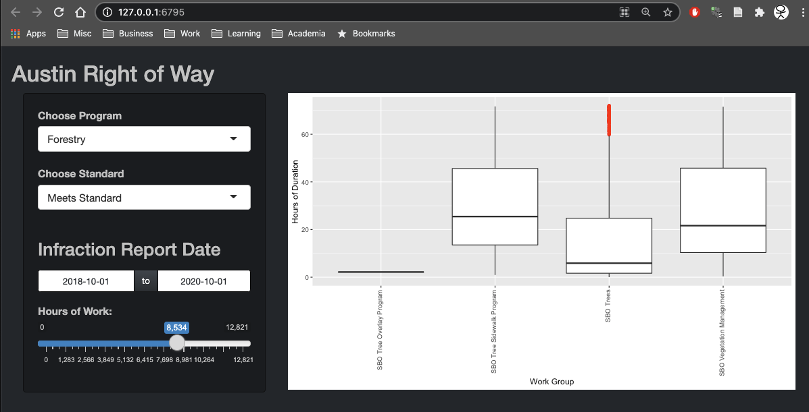

```{r global_options, include=FALSE}
knitr::opts_chunk$set(fig.pos = 'H')
```

# Introduction

This report focuses on the development of interactive graphics using open-source libraries. Given the author's preference for R and the tidyverse, the R Shiny framework[@shiny] is leveraged to make the visualizations interactive. Using a cross-section of public data from Austin, Texas several visualizations are presented. The report is organized with an overview of the approach employed, a brief description of the datasets selected, and a description of the visualizations.

# Approach

This project leveraged an incremental approach to develop the interactive graphics. First, three datasets were identified with similar theme but with sufficient variability to exercise different visualization techniques. Second, following suitability selection, routines to load, transform, and reduce the data (i.e. a modified version of the classic extract, transform, load (ETL) process) were developed and applied to facilitate graphic development. Third, leveraging ggplot as part of the R tidyverse [@tidyverse], static visualizations were developed to serve as the foundation for interactive development efforts. Fourth, given the foundational static graphics, interesting approaches to subset, filter, or link information were researched and prototyped. Fifth, leveraging several resources to reduce the learning curve [@science2021; @agentle2021] , the interactive visualizations were developed and finalized.

# Datasets

Austin, Texas has a number of datasets publicly available as part of its Open Data initiative [@opendat]. To both exercise and expand the author's personal skills for processing the data and developing interactive visualizations, three diverse datasets from Austin are leveraged. First, the city performance measures for Austin [@AustinPerfMeasures] is a dataset contains 1029 observations across 40 variables. Second, the Texas Department of Criminal Justice (TDCJ) [@inmates] provides a dataset of 121K observations of currently incarcerated individuals 20 variables ranging from demographics to datapoints like date of offense, date of sentence, and current incarceration location. Third, Austin Public Works publishes dataset of Right of Way infractions [@rightofWay] that contains 12K observations of 17 variables that describe attributes like date reported, type of infraction, and duration of violation.

# Visualizations

This section briefly describes and presents screen-shots of each of the three interactive visualizations. Each sub-section maps to a single dataset described in the previous section. One interactive graphic was developed for each dataset.

## Visualization I: Austin Performance Measures

Figure 1 provides an interactive visualization into the performance measures for the city of Austin, Texas. The combo-box is dynamically populated with the unique list of departments in the data set. Then, the department selected by the user is passed to the top plot that gives the raw count of performance measures for the department. Next, the count of measures for each activity within the selected department is shown in the lower plot as a bar chart.

```{r, viz1, echo=FALSE,warning=FALSE, out.width="75%", fig.cap="Ausin Performance Measures"}

```

## Visualization II: Texas Inmate Information

Figure 2 provides an interactive visualization into inmates incarcerated in Texas State prisons as of December 2020. First, a data range widget, dynamically populated with the earliest and latest offense date, allows the user to select the offense date range they wish to investigate. Second, a check-box group populated with the granularity of race selections allows the user to choose which races they wish to investigate. The resulting stacked bar-chart shows the number of inmates by age with the additional information of race (indicated by color) within the selected offense date range.

```{r, viz2, echo=FALSE,warning=FALSE, out.width="75%", fig.cap="Texas Inmate Information"}

```

## Visualization III: Austin Right of Way Violations

Figure 3 provides an interactive visualization into the Austin, Texas data set of right-of-way violations and the work efforts to correct the violations. First, the top combo-box is dynamically populated with the list of top-level programs. Second, the next combo-box is dynamically populated with a list of categories for standards. Third, a dynamically populated date range widget enables the time-frame to be selected. Fourth, a semi-dynamic slider (lower bound manually held to 0) for hours to correct issue is provided. Last, the resultant hours vs. work groups for the user's selection are displayed as John Tukey box-plots [@aboxan]; these thus show the 1st, 2nd, 3rd, 4th quartiles, the median, and the outliers for hours of work for each effort aligned to each work group.

```{r, viz3, echo=FALSE,warning=FALSE, out.width="75%", fig.cap="Austin Right of Way Infractions and Repairs"}

```

# Conclusion

This report provided several examples of how to use the R Shiny framework to make a broad cross-section of datasets from the Texas Open Data Initiative interactive. After providing an overview of the approach, a brief overview of the data sets, and then provided sample static screen-shots and descriptions of the interactive visualizations. The skills demonstrated in the report are very important and valuable going forward as the ability to leverage open-source routines to make diverse datasets interactive is critical to making data actionable.

\pagebreak

# References
